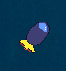
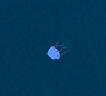

# Submarine

l'idée de ce jeu vient de celle d'un de mes amis, qui lui-même voulait faire un jeu avec le thème de la mer. C'est un simple jeu où on doit récupérer un trésor et sortir à la surface évitant des méduses et des pieuvres.

## Les contrôles du jeu
le sous-marin était fait en sorte qu'il serait moyenement difficile 
à controller, pour y répliquer un tout petit peu des contrôles plus réalistiques. Ont ne peut pas tourner en avancant, ce qui rend l'exploration plus stratégique, surtout avec les méduse qui vous poursuis.

